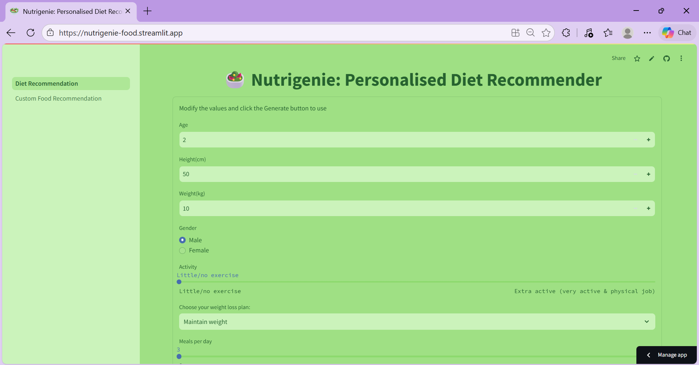
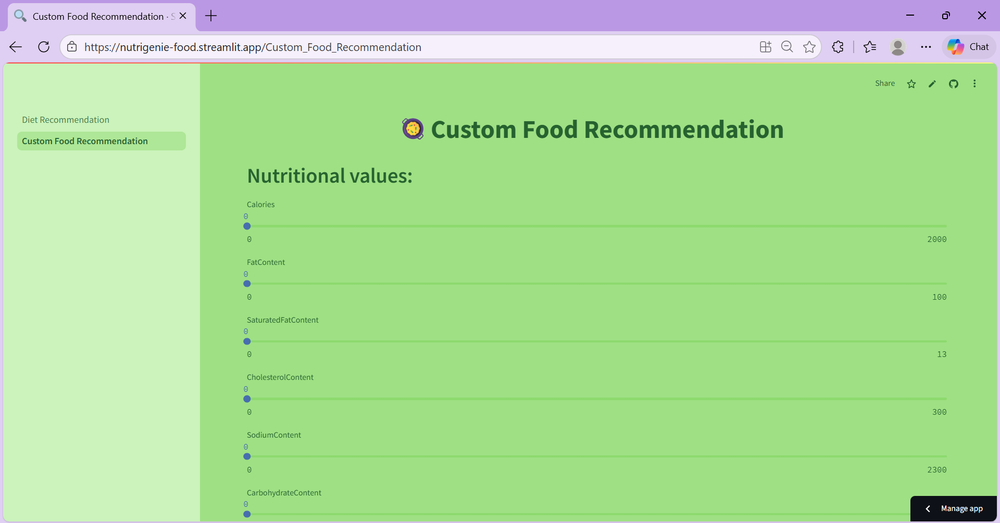
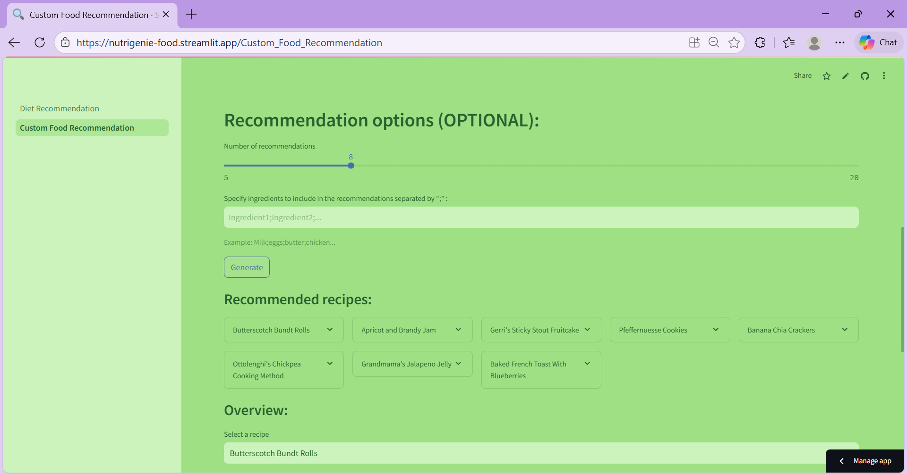
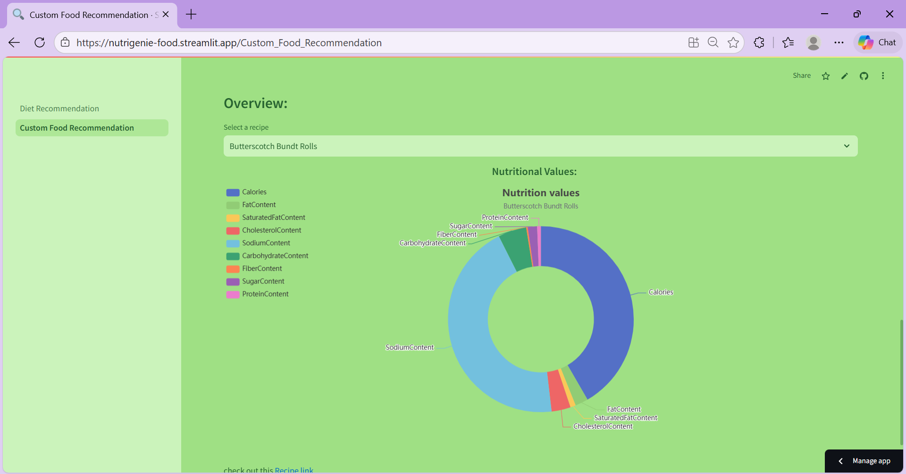

# 🥗 Nutrigenie: Personalised Diet Recommender

A smart, ML-powered diet recommendation app that generates personalised meal plans based on your body metrics, activity level, and nutritional preferences — powered by a cosine similarity Nearest Neighbors model trained on 500,000+ recipes.

**Live App:** https://nutrigenie-food.streamlit.app  
**Backend API:** https://nimishaaaw-nutrigenie-backend.hf.space

---

## 🚀 Deployment Status

[](https://nutrigenie-food.streamlit.app)
[](https://nimishaaaw-nutrigenie-backend.hf.space)
[](https://huggingface.co/datasets/nimishaaaw/nutrigenie-data)
[](https://www.kaggle.com/datasets/shuyangli94/food-com-recipes-and-user-interactions)

---

## ✨ Features

- 🧮 **BMI Calculator** — Instantly calculates your Body Mass Index and category
- 🔥 **Calories Calculator** — Estimates daily calorie needs across 4 weight plans
- 🍽️ **Personalised Diet Recommendation** — AI-generated meal plans for breakfast, lunch, dinner and snacks based on your age, weight, height, gender and activity level
- 🥦 **Custom Food Recommendation** — Filter recipes by specific nutritional values using sliders
- 📊 **Interactive Donut & Bar Charts** — Visual nutritional breakdown for every recommended recipe
- 🍱 **Meal Composition Planner** — Choose your favourite recipe from each meal and compare total calories vs your maintenance target
- 🔗 **Recipe Links** — Direct links to full recipes on Food.com

---

## 🛠 Tech Stack

### Frontend


### Backend


### ML / Data


### Deployment


---

## 🧠 How It Works

### Model
The recommendation engine uses a **Nearest Neighbors algorithm** (scikit-learn) — an unsupervised learner for implementing neighbor searches. It supports BallTree, KDTree, and brute-force algorithms. For this project, the **brute-force algorithm with cosine similarity** is used for fast and accurate recipe matching:

$$\cos(\theta) = \frac{A \cdot B}{\|A\| \cdot \|B\|}$$

The model takes a user's nutritional requirements as input and finds the closest matching recipes from the dataset.

### Backend
Built with **FastAPI** — a fast, modern Python web framework. When a user submits their data (age, weight, activity, preferences), the API runs the Nearest Neighbors model and returns a ranked list of recommended recipes as JSON.

### Frontend
Built with **Streamlit** — an open-source Python framework for data science apps. The UI has two pages:
- **Diet Recommendation** — enter personal stats, get a full meal plan with BMI, calorie targets, and recipe recommendations
- **Custom Food Recommendation** — manually set nutritional values via sliders and browse matching recipes

---

## 📊 Dataset

Uses the **Food.com Recipes & Interactions** dataset from Kaggle — over **500,000 recipes** and **1,400,000 reviews**.

[](https://www.kaggle.com/datasets/shuyangli94/food-com-recipes-and-user-interactions)

---

## 📸 Screenshots

### 🏠 Diet Recommendation Page


### 📊 BMI & Calories Calculator


### 🍱 Meal Composition Planner


### 🎯 Custom Food Recommendation



---

## 🖥 Run Locally

### Clone Repository
```bash
git clone https://github.com/nimishaaaaaw/nutrigenie.git
cd nutrigenie
```

### Backend
```bash
cd FastAPI_Backend
pip install -r requirements.txt
uvicorn main:app --host 127.0.0.1 --port 8080 --reload
```

### Frontend
```bash
cd Streamlit_Frontend
pip install -r requirements.txt
streamlit run 1_💪_Diet_Recommendation.py
```

> **Note:** Make sure the backend is running before starting the frontend. The frontend calls the backend API at `http://localhost:8080`.

---

## 🐳 Docker (Backend)

```bash
cd FastAPI_Backend
docker build -t nutrigenie-backend .
docker run -p 7860:7860 nutrigenie-backend
```

---

## 📌 Future Improvements

- 🌍 Support for regional/cuisine-based filtering
- 📱 Mobile-friendly UI improvements
- 🧬 Integration with wearable health data
- 📧 Email-based diet plan delivery
- 🌙 Dark mode toggle
- ⭐ Recipe rating and favourites system

---

## 👩‍💻 Author

**Nimisha Majgawali**  
Full Stack Developer  

[](https://github.com/nimishaaaaaw)
